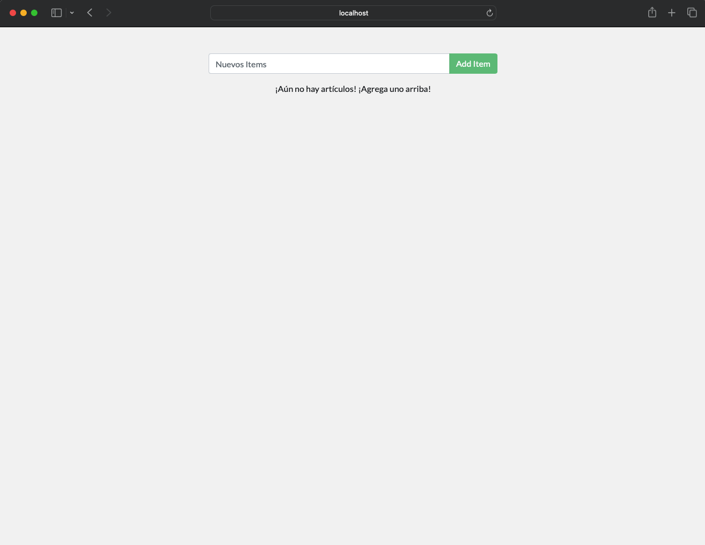

### Proyecto Final: Todo-List App con Enfoque DevOps

#### Descripción del Proyecto
El proyecto consiste en una aplicación tipo "Todo-List" utilizando tecnologías modernas de desarrollo web y operaciones de infraestructura, con un enfoque específico en DevOps. La aplicación estará compuesta por un backend Node.js con Express y una base de datos MySQL. Utilizaremos herramientas como Terraform para la infraestructura como código (IaC), CI/CD para automatización del flujo de trabajo, contenedores Docker para la portabilidad y Kubernetes para la orquestación de contenedores. Además, se incorporarán prácticas de observabilidad para garantizar la monitorización y la resolución proactiva de problemas.

#### Componentes del Proyecto

1. **Aplicación Todo-List:**
   - Desarrollar una aplicación web simple utilizando Node.js [18] y Express para el backend.
   - Usar npm
   - La aplicación permitirá a los usuarios crear, leer, actualizar y eliminar tareas de una lista.
   - Se integrará con una base de datos MySQL para almacenar las tareas.
   - Nombre de la bases de datos: todos

#### **AVANCE DEL PROYECTO**
   -   Se instalaron todas las dependencia del proyecto de todo list
   -   luego se creo el archivo dockerfile con las instrucciones para la creacion del contenedor de la app
   -   luego la creacion de un archivo yml para el docker compose para poder orquestar los contenedores de manera local
   -   en el docker compose se configuo la imagen y puerto de la app
   -   tambien se configuro la imagen de mysql y phpmyadmin con su variables y salida de puertos
   -   era necesario hacer que la app se conectara con el contenedor de mysql
   -   las variables de entorno se colocaron el archivo yml, para que existiera esa comunicacion entre la app y mysql
   -   una vez que se levanto la app, comprobe la comunicacion mediante phpmyadmin
   -   luego subi las imagenes a mi usuario en docker hub
   -   sigo avanzando para hacer las demas etapas del proyecto Devops
